1D (univariate)  continous ( smooth) [color gradients](https://en.wikipedia.org/wiki/Color_gradient) ( colormaps) implemented in c and gnuplot for:
* real type data normalized to [0,1] range  ( univariate map)
* integer ( or unsigned char) data normalized to [0.255] range

and how to [manipulate them](README.md#gradient-manipulations) ( invert, join, turned into a cyclic or wrapped color gradient )


# TOC
* [Introduction](README.md#introduction)
* [Gradient manipulations](README.md#gradient-manipulations)
* [Examples of continous colour maps/gradients](README.md#examples-of-continous-colour-mapsgradients)
* [gradient forms](./doc/THEORY.md#gradient-forms)
* [features of colormaps ( gradients)](./doc/THEORY.md#features-of-colormaps)
* [taxonomy of color gradients](./doc/THEORY.md#taxonomy-of-color-gradients)
* [gradient goals](./doc/THEORY.md#gradient-goalstasks-goals-of-visualisation)
* [gradeint metrics](./doc/THEORY.md#gradient-metrics)
* [gradient applications ](./doc/THEORY.md#gradient-aplications)
* [FAQ](./doc/FAQ.md)
* [Dictionary](./doc/DICTIONARY.md)
* [colorwheel](./doc/colorwheel.md)
* [Links](./doc/LINKS.md)
* [to do](./doc/TODO.md)
* [program files](README.md#programs)
* [similar projects](README.md#similar-projects)

# Introduction

[Why Should Engineers and Scientists Be Worried About Color? by Rogowitz & Treinish 1996](https://github.com/ResearchComputing/USGS_2015_06_23-25/raw/master/25_June/ColorTheory_References/Why%20Should%20Engineers%20and%20Scientists%20Be%20Worried%20About%20Color.pdf)


What should and what should not do colormap/gradient in [scientific visualisation](https://arxiv.org/abs/1909.04835)?
* should highlight features of the data
* should not highlight features that are not in the data but only in the gradient itself = [avoid distorting the data](https://betterfigures.org/2015/06/23/picking-a-colour-scale-for-scientific-graphics/)
  * ["Many colour maps provided by vendors have highly uneven perceptual contrast over their range. Colour maps may have points of locally high colour contrast leading to the perception of false anomalies in your data when there is none. Conversely colour maps may also have 'flat spots' of low perceptual contrast that prevent you from seeing features in the data." Peter Kovesi](https://peterkovesi.com/projects/colourmaps/)
  * ["... obfuscate the data with artifacts that are not in the data and hide important features that are in the data" Kenneth Moreland](http://www.kennethmoreland.com/color-advice/BadColorMaps.pdf) 
  * [prevent significant visual errors, which would otherwise visually distort the underlying data and mislead the reader]()

# Continous gradient manipulations

Gradient function:
* monotone (non periodic)
* non monotone
  * diverging = 2 segments of gradients with monotone lightness. Sometimes also called ratio, bipolar, or double-ended color maps. ["A natural usage of this map is the display of some property that has a neutral value and some regions with both “lower” and “higher” values. "](https://tomroelandts.com/articles/the-diverging-color-map-is-the-new-rainbow-color-map)
  * periodic (wave)
    * [continous](https://en.wikipedia.org/wiki/Continuous_function) ( gives tubes , 3d effect): gradient function can be inverted and joined ( both inverted and not inverted part create one wave), repeat it 
    * [discontinous with jump](https://en.wikipedia.org/wiki/Classification_of_discontinuities#Jump_discontinuity) -  [step function](https://en.wikipedia.org/wiki/Step_function) , ( gives [steps](https://en.wikipedia.org/wiki/Stairs#Step)): gradient function can be joined without inversion( 2 non inverted parts are joined, each part is one wave), repeat it  
  
```c
double ModifyPosition(const double position, const GradientJoiningType GradientJoining){
	
	// input position  should be in  [0,1] range 
	double p = position; // p = local copy of position
	// if position > 1 then we have repetition of colors = periodic function = wave   
	
	
	switch(GradientJoining){
	
		case no : {break;} // return input position witout modifications
		
		// periodic waves with different joinings
		case steps : {	p = p * segments; // periodic  = change range
				p = frac(p); 
    				break;}
    				
		case tubes : {	p = p * segments; // periodic = change range
				int ip = (int)p;
      				p = p-ip; // fractional part 
      				if (ip % 2) {p = 1.0-p;} // reverse gradient
				break;}
		default:{}
	}
	return p; // output in [0,1] range
}
```


  
  
  
## Step function:
* highliths the boundaries of level sets

Examples
* [grayl-colormap](README.md#grayl-colormap)


Example videos by [Maths Town](https://www.youtube.com/channel/UC6qEdtxp_IAaVrNAHUIhHbQ):
* [Steps to Infinity - Mandelbrot Fractal Zoom (2e1289) - with "'''angle'''" shading for a psuedo-3D effect](https://www.youtube.com/watch?v=r3lS5Qb2J78&list=PLKHNByHfHxT6MRKBPaoQqVJcIat-A6FVU&index=116&t=25s) 
* [Ship of Spirals - Burning Ship Fractal Zoom](https://www.youtube.com/watch?v=Zicl9NCWOnM&t=235s)


## Tubes
* converts ["boring rectangle to into a stunning three dimensional glossy pipe"](https://www.presentation-process.com/powerpoint-gradients-3D.html)  


  
# Examples of 1D colour maps/gradients ( mostly continous)
  
Examples by hue:
* ``Multihue = rainbows``
  * non monotone lightness
    * [Rainbow](README.md#rainbow-colormap-or-sawtooth-rainbow-or-hsv) 
    * Linas and Linas2
    * Linas2 
    * RainbowHSP 
    * [RainbowFractalizer](README.md#rainbowfractalizer)
    * [OrangeBlueFractalizer](README.md#rainbowfractalizer)
    * [Fractint default](README.md#default-fractint-map)
  * monotone lightness - perceptually uniform
    * Magma - 
    * [Cubehelix](README.md#cubehelix)
  * diverging ( 2 segments of gradients with monotone lightness)
    * [CoolWarm (smooth diverging )](README.md#smooth-coolwarm-diverging-colormap)
    * [Bent Cool Warm](README.md#bent-cool-warm-diverging-)
    * [arctic](README.md#arctic)
* ``NoHue = Gray``
  * Linear 
  * sin
  * LSin
  * SinExp
  * [GraySine](README.md#graysine-effect-of-a-sine-wave) ( similar to SmoothStep = 25 and SmoothSteps= 26 )
  * [NL2 = quadratic](README.md#gray-nl3-cubic-colormap) 
  * [Cubic = NL3](README.md#gray-nl3-cubic-colormap)
  * [CubicInv](README.md#cubicinv)
  * [Sqrt](README.md#gray-sqrt-colormap) 
  * [Gamma](README.md#graygamma) 
  * [Tanh](README.md#tanh)
* ``single hue``
  * [Green](README.md#green-colormap) - monotne lightness
  * HSP 
  
```c
// d.c 
		// multihue		
  		case RainbowHSV: 	{GiveRGB_RainbowHSV(p, rgb); break;}
  		case Linas: 		{GiveRGB_Linas(p, rgb); break;}
  		case Linas2: 		{GiveRGB_Linas2(p, rgb); break;}
  		case RainbowFractalizer:{GiveRGB_RainbowFractalizer(p, rgb); break;} //
  		case OrangeBlueFractalizer: {GiveRGB_OrangeBlueFractalizer(p, rgb); break;} 
  		case Magma: 		{GiveRGB_Magma(p, rgb); break;}
  		case Cubehelix:	{GiveRGB_Cubehelix(p, rgb); break;}
  		case RainbowHSP: 	{GiveRGB_RainbowHSP(p, rgb); break;}
  		case HSP:	 	{GiveRGB_HSP(p, rgb); break;}
  		// diverging 
  		case CoolWarm: 	{GiveRGB_CoolWarm(p, rgb); break;}
  		// single hue
  		case GreenCubic: 		{GiveRGB_GreenCubic(p, rgb); break;}
  		case GreenCubicInv: 		{GiveRGB_GreenCubicInv(p, rgb); break;}
  		case GreenCubicRoot: 		{GiveRGB_GreenCubicRoot(p, rgb); break;}
  		case BlueCubicInv: 		{GiveRGB_BlueCubicInv(p, rgb); break;}
  		case RedCubicInv: 		{GiveRGB_RedCubicInv(p, rgb); break;}
  		case GreenSin: 		{GiveRGB_GreenSin(p, rgb); break;}
  		 
  		// no hue = gray, one function for all gray gradients
  		case Linear: 	
  		case Quadratic: 	
  		case Cubic: 
  		case CubicInv:		
  		case Sqrt: 
  		case Root:		
  		case Gamma: 		
  		case Sin: 		
  		case LSin: 		
  		case SinExp: 	
  		case Smooth: 	
  		Tanh : {GiveRGB_Gray(p, ColorTransferFunction, rgb); break;}  
```
  
  


## Rainbow colormap or sawtooth rainbow or hsv

Rainbow
* ["Probably the most (in)famous in data visualization"](http://www.sci.utah.edu/~chris/IBBM-Visualization-2018/IBBM-Visualization-2.pdf)
* [should not be used in scientific computing](https://blogs.egu.eu/divisions/gd/2017/08/23/the-rainbow-colour-map/)
* "One minor problem is that (true) rainbows end in violet, not red." – AnnanFay 


")  
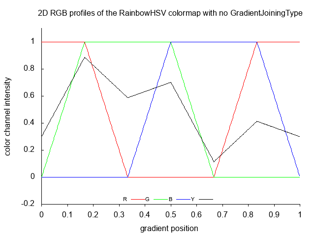  


Compare with [gnuplot image](https://commons.wikimedia.org/wiki/File:Gnuplot_HSV_gradient.png)  


Features of rainbow gradient:
* non monotone ( see black curve) , 
* cyclic
* multi hue
* complex = consist of 6 monotone segments ( ramps). Graph of the lightness looks like [saw with  plain tooth pattern](https://en.wikipedia.org/wiki/Crosscut_saw) or [triangle sawtooth wave](https://en.wikipedia.org/wiki/Sawtooth_wave)


### HSV
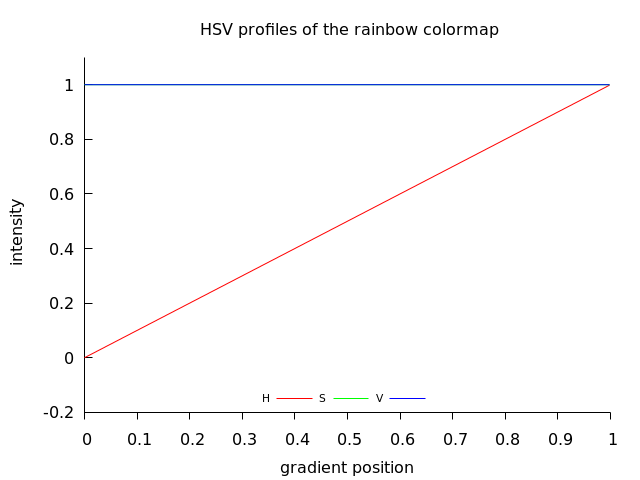  
["cyclic colormap traversing HSV color space. The map is obtained by linearly varying the hue through all possible values while keeping constant maximum saturation and value." ](https://octave.sourceforge.io/octave/function/hsv.html)

```gnuplot
set palette model HSV functions gray,1,1
```

or in [C#](https://stackoverflow.com/questions/2288498/how-do-i-get-a-rainbow-color-gradient-in-c)
```c#
for(double i = 0; i < 1; i+=0.01)
{
    ColorRGB c = HSL2RGB(i, 0.5, 0.5);
    //do something with the color
}
```

 


### RGB
[Description by Laurence Gonsalves](https://stackoverflow.com/questions/1211705/paint-me-a-rainbow)

>>>
It can be done directly in RGB space by a linear interpolation (in RGB) between each consecutive pair in this sequence:
* #ff0000 = red = rgb(255,0,0)
* #ffff00 = yellow = rgb (255,255,0)
* #00ff00 = green = rgb(0,255,0)
* #00ffff = cyan = rgb(0,255,255)
* #0000ff = blue = rgb(0,0,255)
* #ff00ff = magenta = rgb(255,0,255)
* #ff0000 = red = rgb (255,0,0)

Note that only one component changes for each interpolation, which simplifies things.
>>>


See [css linear gradient](https://www.tutorialspoint.com/linear-gradient-with-rainbow-color)

```html
linear-gradient(to right, red,orange,yellow,green,blue,indigo,violet);
```       

or python:

```python
def rainbow():
  r, g, b = 255, 0, 0
  for g in range(256):
    yield r, g, b
  for r in range(255, -1, -1):
    yield r, g, b
  for b in range(256):
    yield r, g, b
  for g in range(255, -1, -1):
    yield r, g, b
  for r in range(256):
    yield r, g, b
  for b in range(255, -1, -1):
    yield r, g, b

```


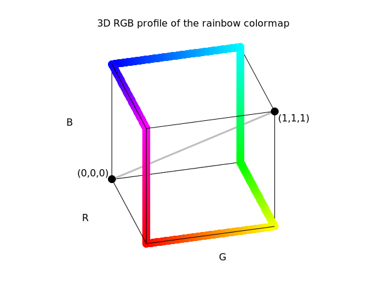 


### c function:
*  GiveRainbowColor from [p.c file](./src/p.c)  
*  ComputeAndPrintColor from [h.c file](./src/h.c) which uses gnuplot function HSV_2_RGB from file [src/getcolor.c](https://sourceforge.net/p/gnuplot/gnuplot-main/ci/master/tree/src/getcolor.c)

### modifications


")  
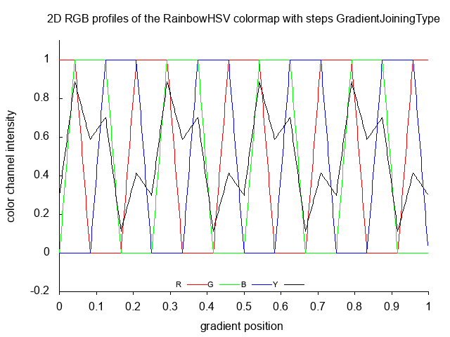  

")  
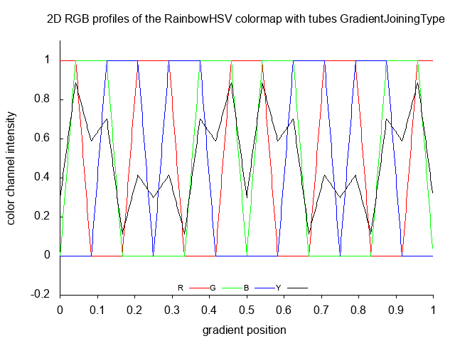  


### See also
* [CIE LAB LINEAR L* RAINBOW](https://mycarta.wordpress.com/2012/12/06/the-rainbow-is-deadlong-live-the-rainbow-part-5-cie-lab-linear-l-rainbow/)
* [hcl rainbow](http://hclwizard.org/why-hcl/)
* [perceptual-rainbow by Matteo Niccoli](https://mycarta.wordpress.com/2013/02/21/perceptual-rainbow-palette-the-method/)
* [A Less-Angry Rainbow by Mike Bostock](https://bl.ocks.org/mbostock/310c99e53880faec2434)
* [isoluminant rainbow](https://mycarta.wordpress.com/2014/10/30/new-matlab-isoluminant-colormap-for-azimuth-data/)
* [Rainbow (perceptually linearized) ColorRGB SCALE by Steve Pizer](http://www.cs.uml.edu/~haim/ColorCenter/ColorCenterColormaps.htm)
* rainbow is used as a name of the multihue gradient family 

```html
var spaces = [
  {
    name: "Rainbow (HSL)",
    color: function(t) {
      return d3.hsl(t * 360, 1, .5);
    }
  },
  {
    name: "Rainbow (HCL)",
    color: function(t) {
      return d3.hcl(t * 360, 100, 55);
    }
  },
  {
    name: "Rainbow (Cubehelix)",
    color: d3.scale.cubehelix()
        .domain([0, .5, 1])
        .range([
          d3.hsl(-100, 0.75, 0.35),
          d3.hsl(  80, 1.50, 0.80),
          d3.hsl( 260, 0.75, 0.35)
        ])
  }
];
```

## Linas colormap


")  
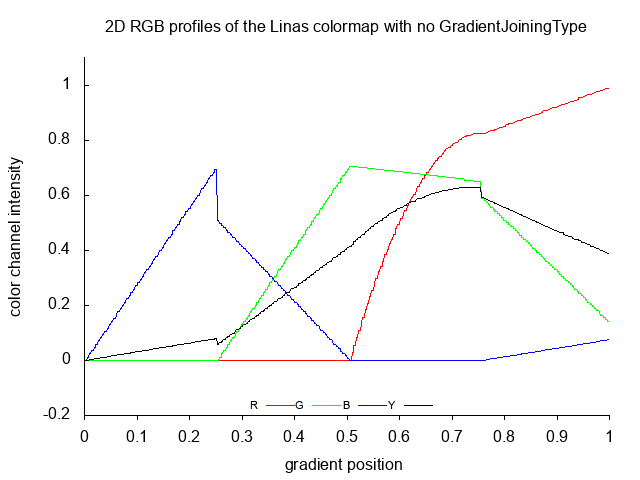  


>Your new colormap is different and ugly-ish. The line between red-and-yellow is much much worse than before.  the red-yellow discontinuity is ... confusing, annoying. .. to me, at least. Linas

Features of Linas gradient:
* non monotone ( see black curve) 
* complex = consist of 4 monotone segments
* the red-yellow discontinuity can be seen as a [jump discontinuity](https://en.wikipedia.org/wiki/Classification_of_discontinuities#Jump_discontinuity) of the green, red and black curve at gradient position 0.753333	

```txt
0.743333	 210	166	0
0.746667	 210	166	0
0.750000	 210	166	0
0.753333	 210	166	0
0.756667	 210	150	0
0.760000	 210	150	0
0.763333	 210	148	0
0.766667	 211	146	0
0.770000	 212	144	1
0.773333	 213	142	1
0.776667	 213	142	1
0.780000	 213	140	1
```

so R jumps from 166 to 150   


I have chaged it manually :  
* only 5 points = 4 linear segments
* last point ( position) changed to 1.00000

```txt
0.000000	0	0	0
0.250000	0	0	177
0.500000	0	175	0
0.750000	210	156	0
1.000000	252	36	19
```

or in the 0-1 normalized 4 columns form:  

```txt
0.000000 0.000000 0.000000 0.000000
0.250000 0.000000 0.000000 0.458823
0.500000 0.000000 0.686274 0.000000
0.750000 0.823529 0.611764 0.000000
1.000000 0.988235 0.141176 0.074509
```

which can be used by gnuplot command:   
```gnuplot
load "linas.pal"
```
and then check:  

```gnuplot
 show palette gradient
  0. gray=0.0000, (r,g,b)=(0.0000,0.0000,0.0000), #000000 =   0   0   0
  1. gray=0.2500, (r,g,b)=(0.0000,0.0000,0.4588), #000075 =   0   0 117
  2. gray=0.5000, (r,g,b)=(0.0000,0.6863,0.0000), #00af00 =   0 175   0
  3. gray=0.7500, (r,g,b)=(0.8235,0.6118,0.0000), #d29c00 = 210 156   0
  4. gray=1.0000, (r,g,b)=(0.9882,0.1412,0.0745), #fc2413 = 252  36  19
```


Now one can compute: 4 functions for each color channel ( 12 functions) using [polysolve by P. Lutus](https://arachnoid.com/polysolve/).
Result:   


")  
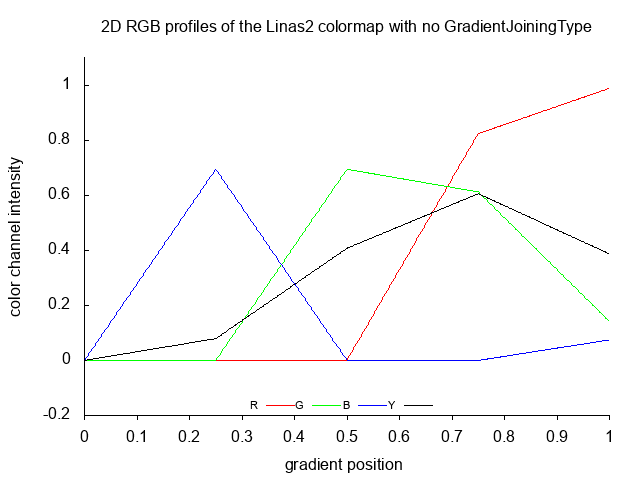  


C code for Linas gradient:
* old (= bad):  funcion GiveLinasColor from [p.c](./src/p.c)
* new (= good): function GiveLinas2Color from [p.c](./src/p.c)


Examples of use: [Linas art gallery - my version of Linas programs with old gradient](https://gitlab.com/adammajewski/LinasArtGallery_MandelbrotSet)


modifications:

")  
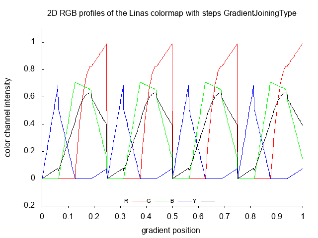  


")  
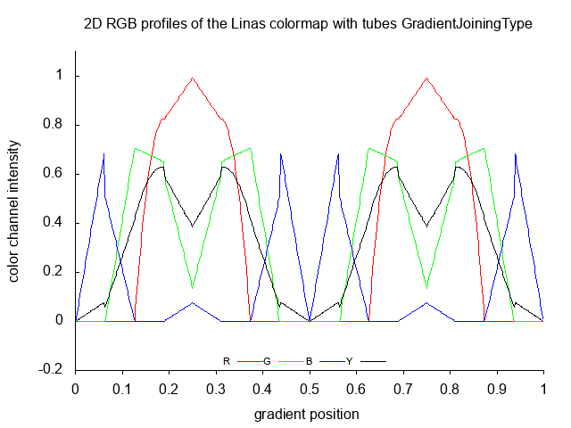  


")  
  


")  
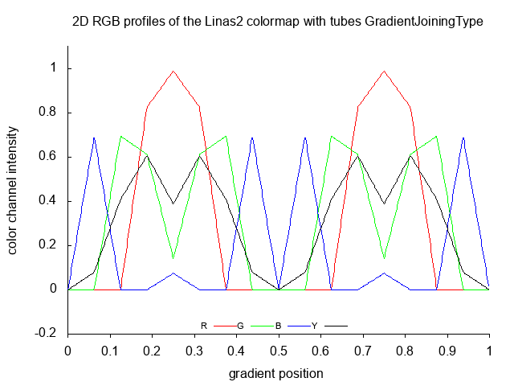  

    
    
## Magma colormap
")  
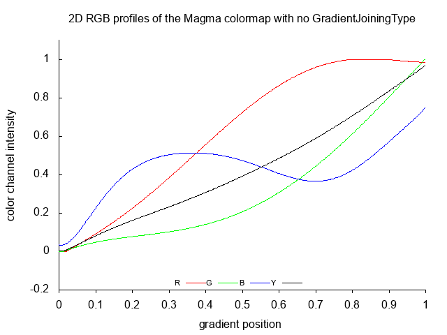    

c function = GiveMagmaColor from [p.c file](./src/p.c)  

lightness is monotone  

Steps:  
")  
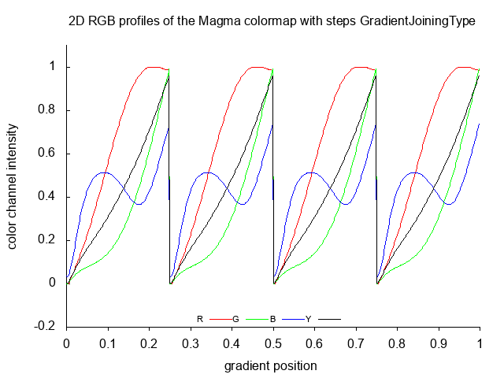    


Tubes:  
")  
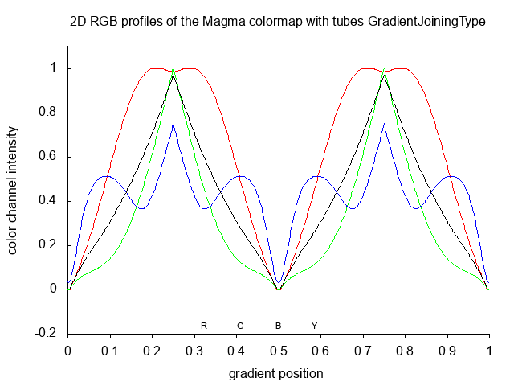    

## RainbowFractalizer

It is rainbow gradient from the [Fractalizer program](http://www.fractalizer.de/en/).   

It has [7 segments and black color](https://graphicdesign.stackexchange.com/questions/140962/how-can-i-read-colors-along-path)

lightness is non monotone  


")  
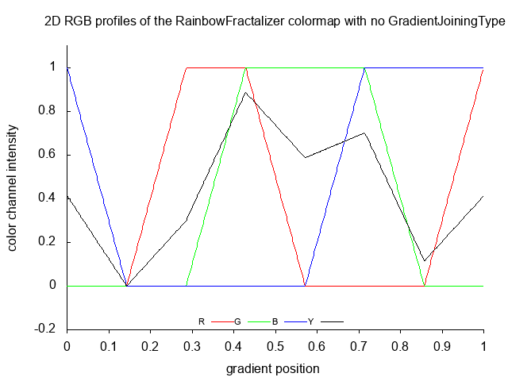    


c function = GiveRainbowFractalizer from [d.c file](./src/d.c)  

Steps:  
")  
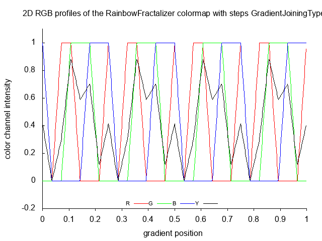    

Tubes:  
")  
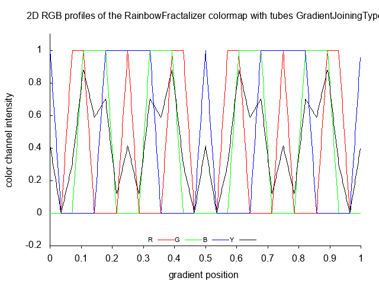    


See also:
* [images at commons](https://commons.wikimedia.org/wiki/Category:Fractals_made_with_Fractalizer)


## OrangeBlueFractalizer

It is orange-blue gradient from the [Fractalizer program](http://www.fractalizer.de/en/).   

Features:
* lightness is non monotone
* Looks like diverging gradient
* it has the same color on both ends 
* It has 5 segments:
  * black 
  * orange (255,80,0)
  * yellow ( 255, 255,128) = Unmellow Yellow = canary 
  * white
  * blue
  * black


  

")  
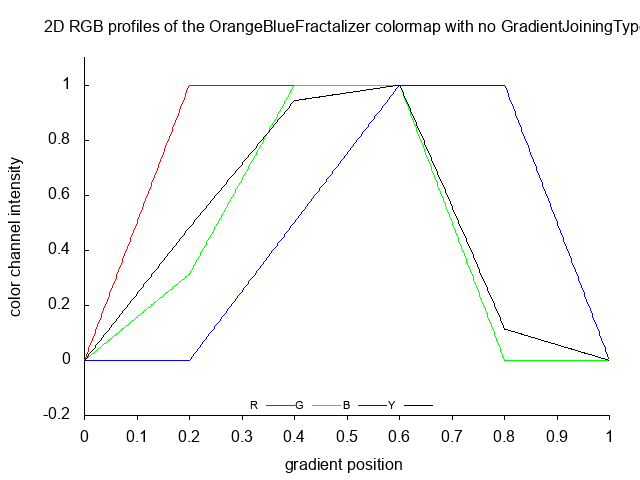    


c function = GiveOrangeBlueFractalizer from [d.c file](./src/d.c)  


Steps:  

")  
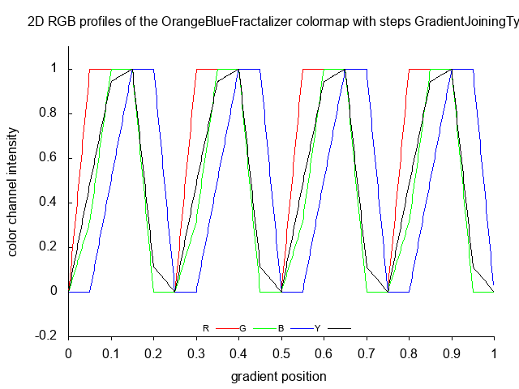    


Tubes:  

")  
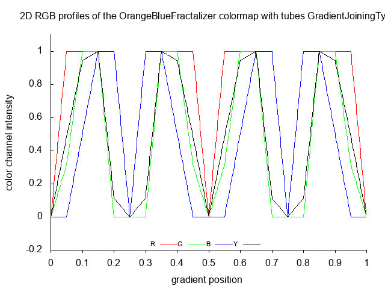    


See also:
* [images at commons](https://commons.wikimedia.org/wiki/Category:Fractals_made_with_Fractalizer)


## Gray Linear colormap
Linear function

")  
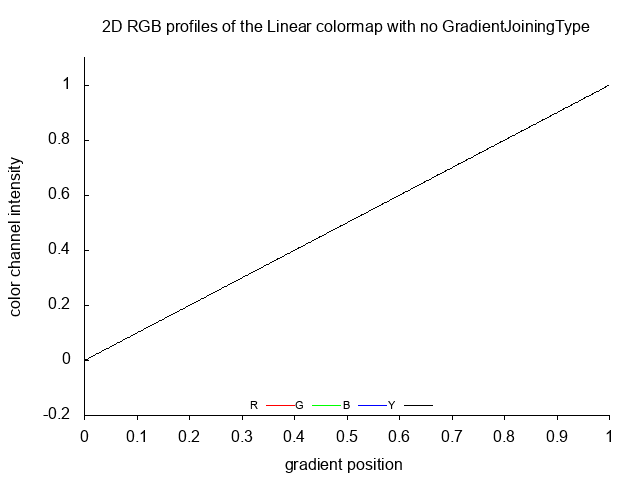    


c function:  
* (old) GiveGrayColorL from [p.c file](./src/p.c)  
* (new) GiveRGB_Gray case Linear from [d.c file](./src/d.c)  


Effect of joining gradients ( segments of the same gradient combined):   
* [Sawtooth wave](https://en.wikipedia.org/wiki/Sawtooth_wave)

Steps:  
")  
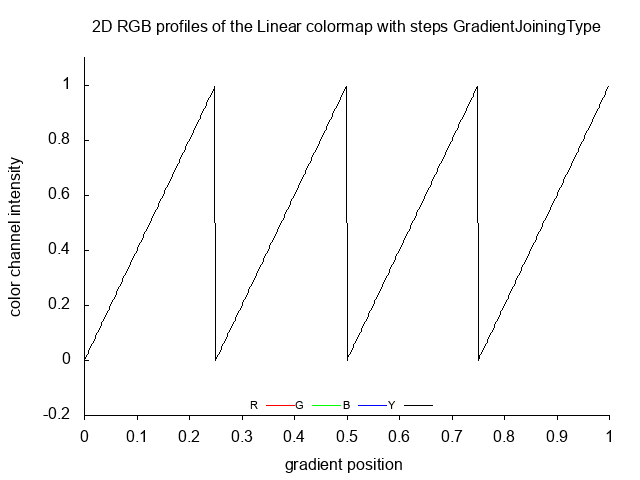    


Tubes:   
")  
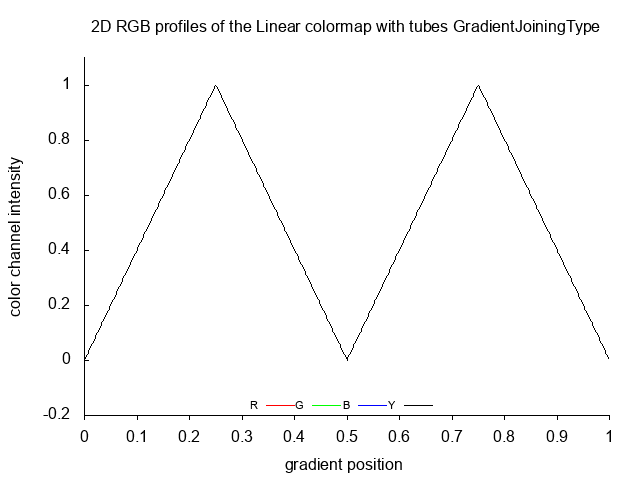    


Example image with use of such gradient:  

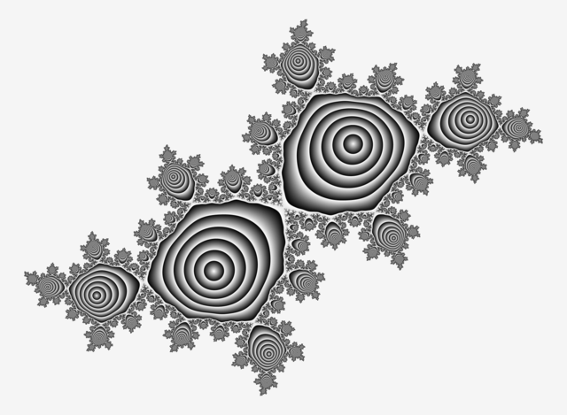  

code and description is in the [commons](https://commons.wikimedia.org/wiki/File:Quadratic_Golden_Mean_Siegel_Disc_Average_Velocity_-_Gray.png)


## Gray Sin: effect of a sine wave 

only ascending wave ( f = 1/2)  

  
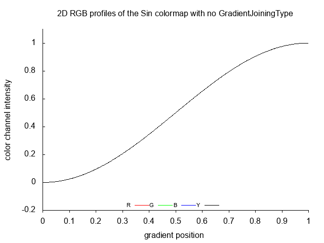    


Adam Sakareassen : "The colours simply fade from black to white in a cycle.  This wave is generated with the sin function.  This method is useful when blending layers to create light to dark contrasts."


   
Steps:  
")  
    

Tubes:   
")  
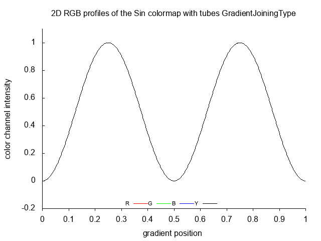    
  


c function = GiveRGB_Gray from [d.c file](./src/d.c)  


Similar to
* [SmoothStep function](https://www.youtube.com/watch?v=60VoL-F-jIQ) by [The Art of Code](https://www.youtube.com/channel/UCcAlTqd9zID6aNX3TzwxJXg)
* DarkLightWave (old name Black and White wave) from [KFMovieMaker](https://www.maths.town/after-effects-plugins/kfmoviemaker) by Adam Sakareassen = 1/4 complete wave ie white to black
  * [On the Beach - Mandelbrot Fractal Zoom by Maths Town](https://www.youtube.com/watch?v=3Hjl_C-zEps)
  * [FF discussion](https://fractalforums.org/kalles-fraktaler/15/after-effects-plug-in-for-kalles-fraktaler-something-im-working-on/2965)

```c
/* SmoothStep 
it needs   position in range [0.0, 1.0]  
*/
double d = (3.0 -2.0*position)* position*position;
```

Examples of use : 
* [CPM/M](https://gitlab.com/adammajewski/mandelbrot_wiki_ACh) see file [cpmm.c](https://gitlab.com/adammajewski/mandelbrot_wiki_ACh/-/raw/master/src/cpmm.c)

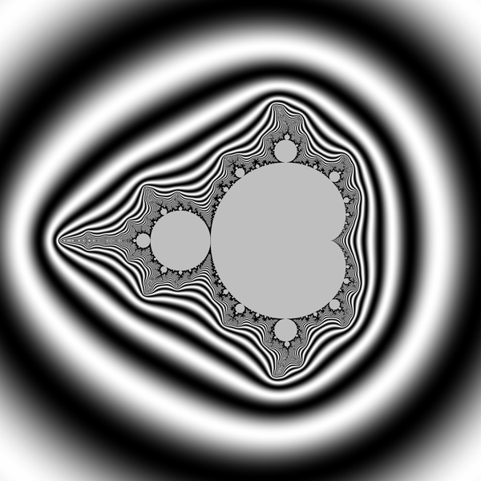    
 


## Gray LSine: effect of [a sine wave superimposed on a ramp function](https://peterkovesi.com/projects/colourmaps/colourmaptestimage.html)

")  
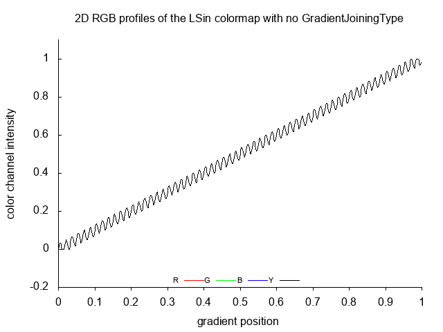    


c function = GiveGrayColorLSine from [d.c file](./src/d.c)  

Steps:  
")  
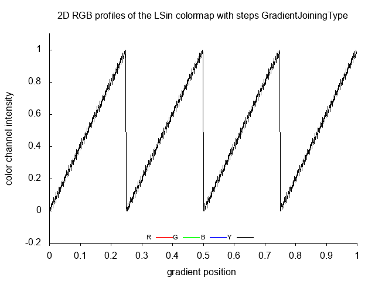    


Tubes:  
")  
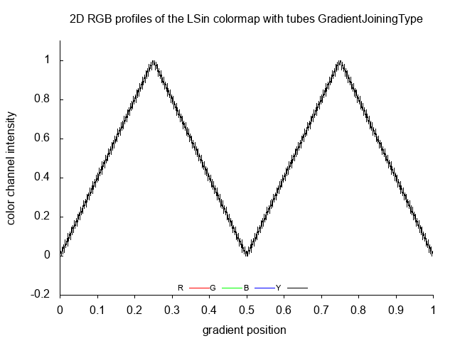    


## Gray SinExp: effect of [a sine(exp) wave ](https://www.cns.nyu.edu/~david/courses/perception/lecturenotes/channels/channels.html)

An exponential [chirp waveform](https://en.wikipedia.org/wiki/Chirp); a sinusoidal wave that increases in frequency exponentially over time


")  
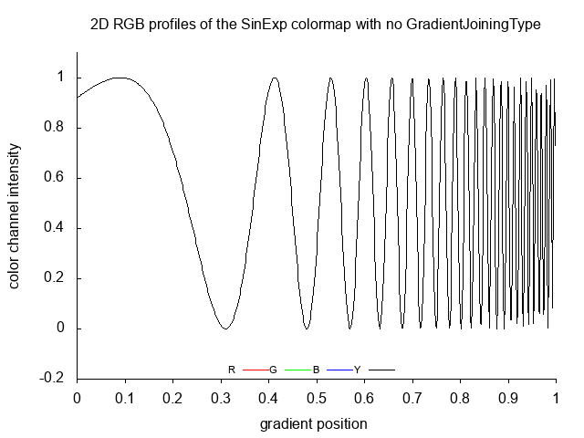    


c function = GiveGrayColorLSineExp from [d.c file](./src/d.c)  

See als:
* [Linear Sine Sweep](http://willfmusic.com/2019/04/09/signal-analysis-ii-linear-vs-logarithmic-sine-sweep/)
* Logarithmic Sine Sweep
* Inverse Logarithmic Filter Sweep


Steps:  
")  
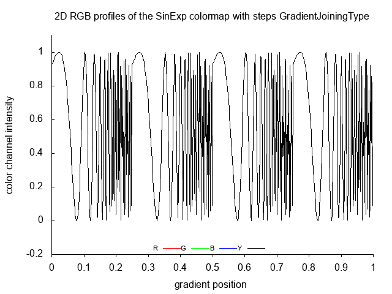    


Tubes:  
")  
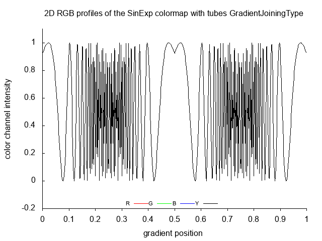    


see also:
* [Perception of visual information: the role of colour in seismic interpretation by  Barbara Froner, Stephen J. Purves, James Lowell  and Jonathan Henderson](https://pdfs.semanticscholar.org/31fc/111a17fc859750a664b0f4be5b60890b427d.pdf)
* [an exponential grayscale cmap by Matteo Niccoli](https://github.com/mycarta/Reproducing-exponential-grayscale-cmap)
* [sigmoid grayscale colormaps](https://github.com/mycarta/Sigmoid_app)
* [Junpei Sekino](http://www.sekinoworld.com/fractal/#story)

## Gray NL2 = Quadratic colormap
")  
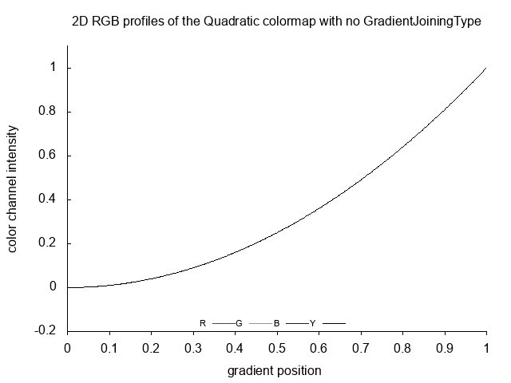  

Steps:  
")  
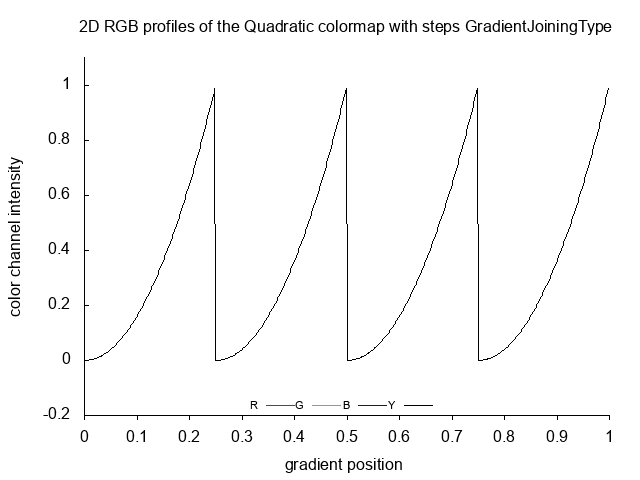  

Tubes:  
")  
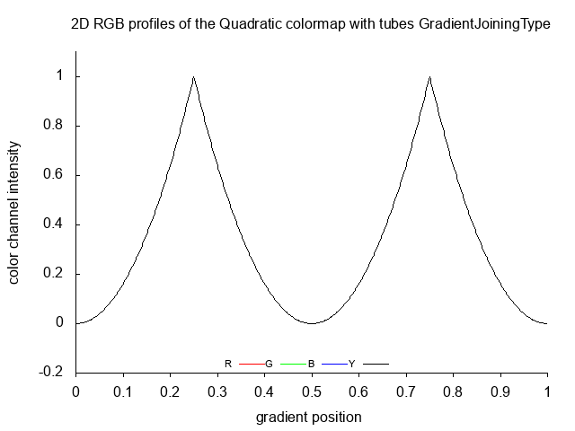  


## Gray NL3 =Cubic colormap
")  
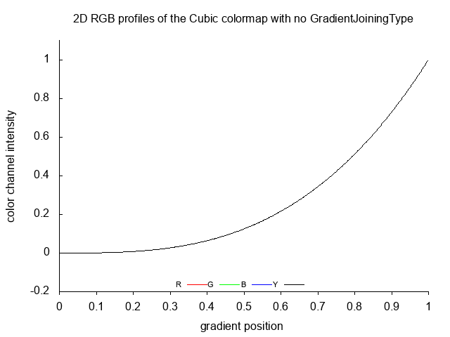  


Steps:  
")  
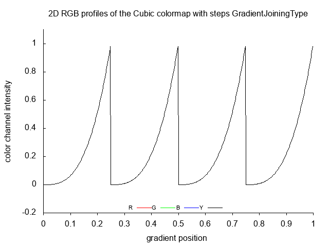  


Tubes:  
")  
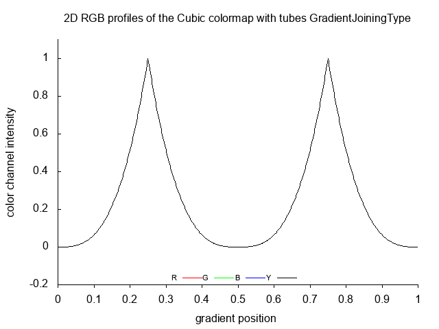  


## CubicInv

")  
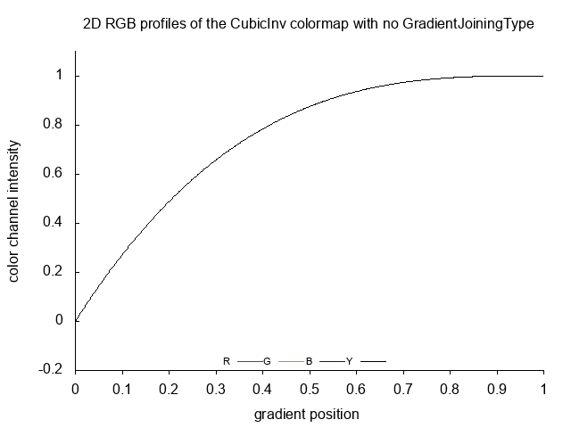  


Steps:  
")  
  


Tubes:  
")  
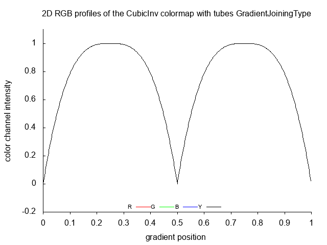  
  
## GrayGamma 
Nonlinear gamma-corrected black and white palette

")  
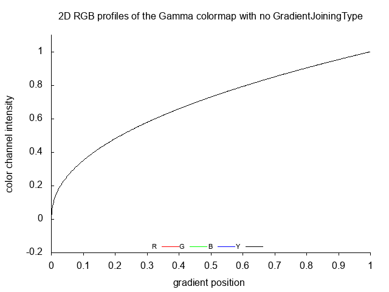  


It is from gnuplot:
```gnuplot
gamma = 2.2
color(gray) = gray**(1./gamma)
set palette model RGB functions color(gray), color(gray), color(gray) # A gamma-corrected black and white palette

```

Steps:  

")  
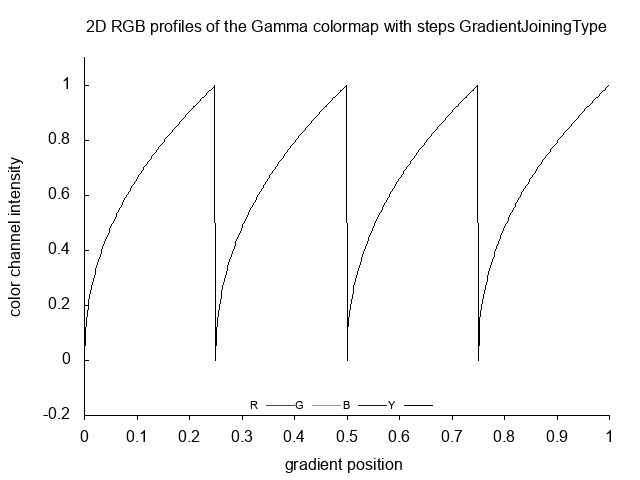  


Tubes:  

")  
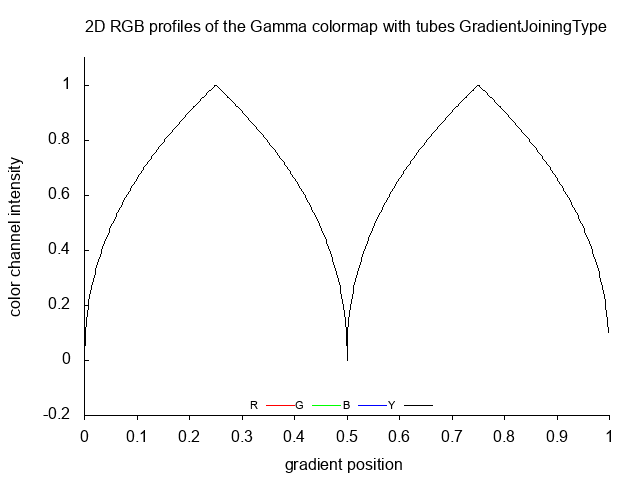  


## Gray Sqrt colormap
")  
  

Steps:  
")  
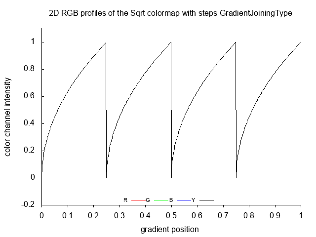  

Gradient can be inverted and joined, which converts ["boring rectangle to into a stunning three dimensional glossy pipe"](https://www.presentation-process.com/powerpoint-gradients-3D.html):

")  
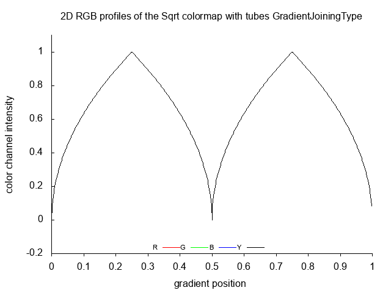  
  

## Tanh
")  
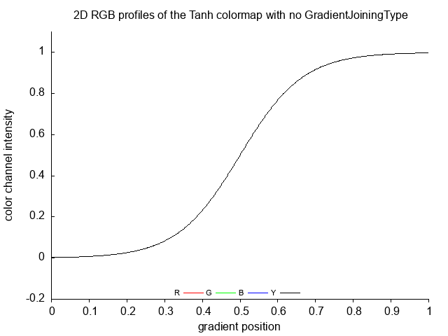  

Steps:  
")  
  

Tubes:  
")  
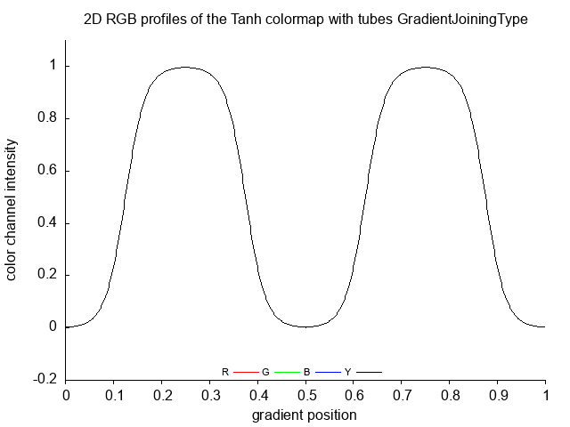  


## GreenCubic colormap
")  
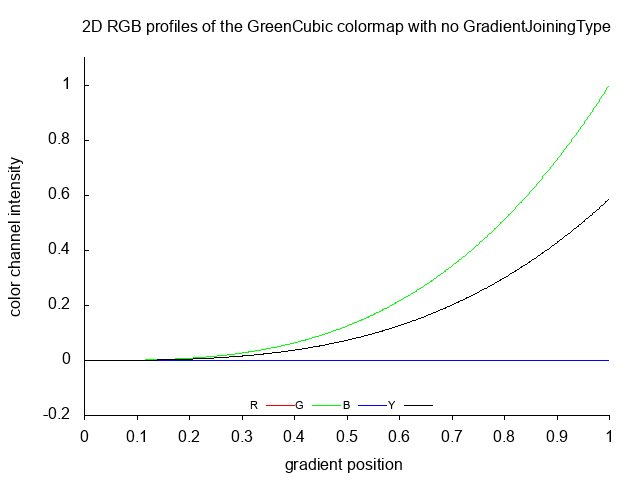  


")  

More is here:
* [commons](https://commons.wikimedia.org/wiki/File:Julia_set_for_f(z)_%3D_z%5E2%2B0.355534_-0.337292*i.png)
* [gitlab](https://gitlab.com/adammajewski/pfm_c)


Features of the green colormap ( gradient):
* shows the order of the data ( thru brightness)
* highlight the boundary ( thru nonlinear green =  1.0 - position^3

```c

// from green to black = 
void GiveColorGreen(double position, double c[]){
	
	
  double X =  1.0- (position*position*position);
  // change range 
  c[0] = 0; //R
  c[1] = X; // G
  c[2] = 0; // B	
}
```
Steps:  
")  
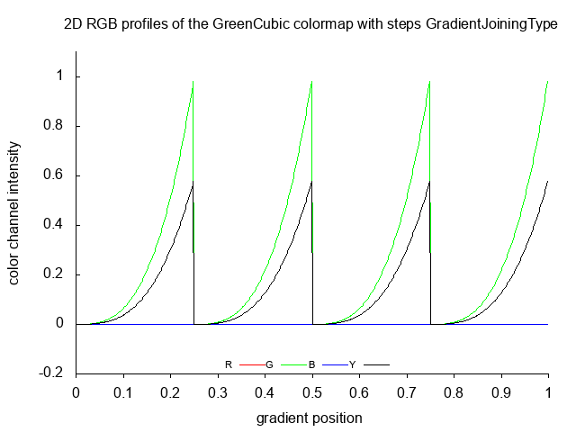  

Tubes:  
")  
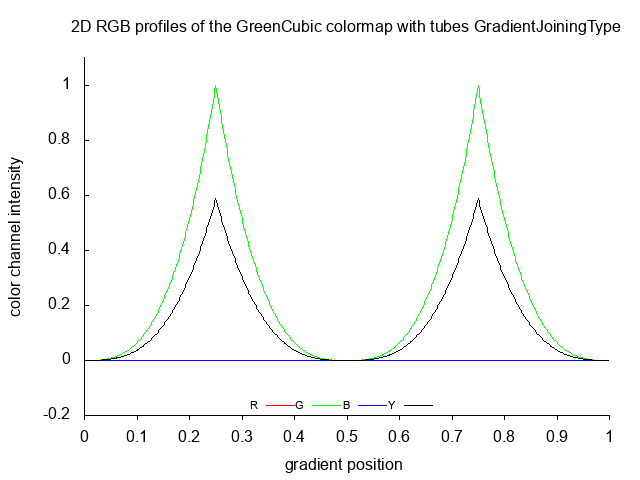  


## GreenCubicRoot colormap
")  
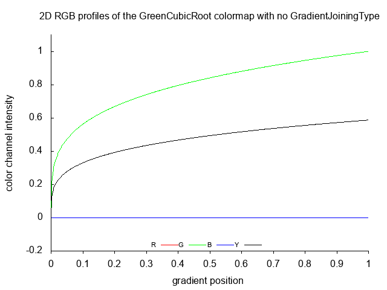  


Steps:  
")  
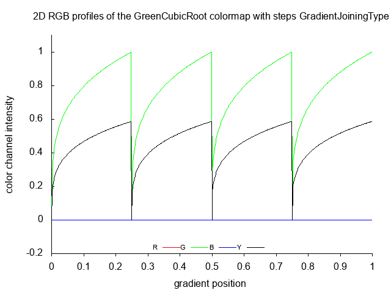  

Tubes:  
")  
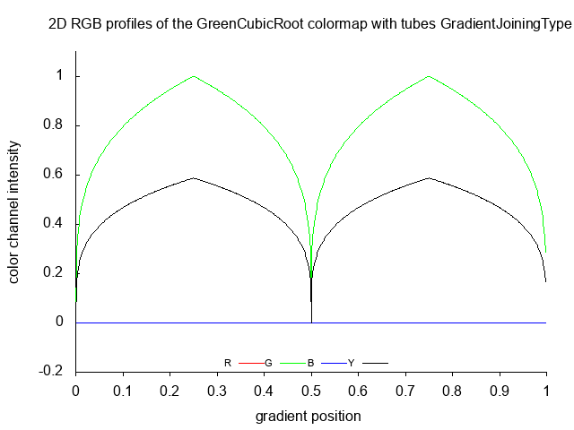  


##  Smooth CoolWarm diverging colormap 
")  
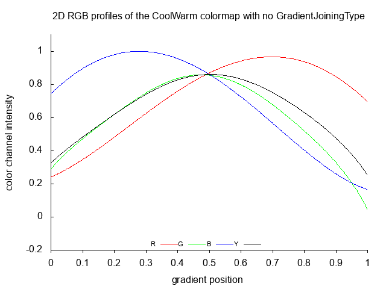  
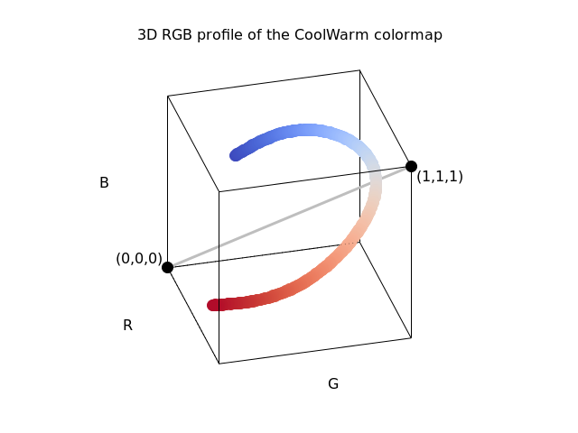


Description by [Kenneth Moreland ](http://www.kennethmoreland.com/color-advice/)  
* blue-red diverging 
* It is a diverging (double-ended) color map with a smooth transition in the middle to prevent artifacts at the midpoint


code:  
* old c funcion GiveColorCoolWarm from [p.c](./src/p.c)
* [diverging_map_gnuplot.pal](diverging_map_gnuplot.pal) - gnuplot palette file

Steps:  
")  
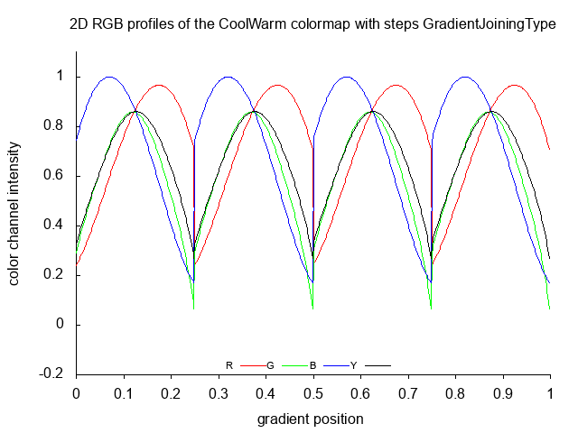  

Tubes:  
")  
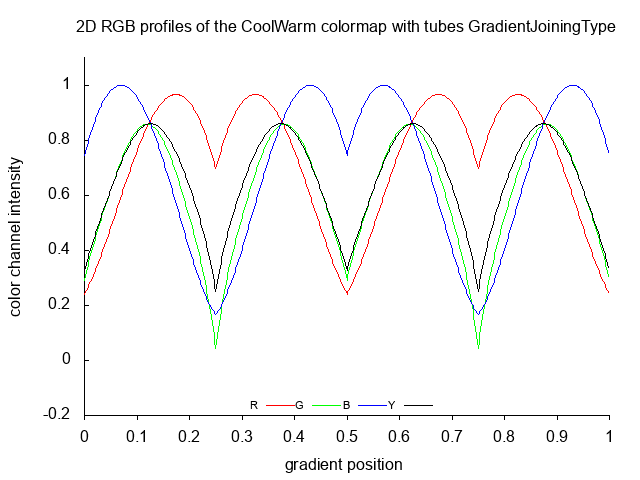  


## Bent Cool Warm ( diverging )

Description by [Kenneth Moreland ](http://www.kennethmoreland.com/color-advice/)  
* This is a similar color map to the previous except that the luminance is interpolated linearly with a sharp bend in the middle. This makes for less washed out colors in the middle, but also creates an artifact at the midpoint.
* "I ... define it with only 3 colors. ... I made the middle point a little less bright (to avoid problems with colors at the edge of what can physically be displayed). ""


## Cubehelix


colour scheme developed by  [Dave Green](http://www.mrao.cam.ac.uk/~dag/CUBEHELIX/):
* for the display of intensity images (which increases in percieved brightness, and prints as greyscale on black and white postscript devices
* [with a linear increase or decrease in brightness and some variation in hue](http://seaborn.pydata.org/tutorial/color_palettes.html#sequential-cubehelix-palettes) 

")  
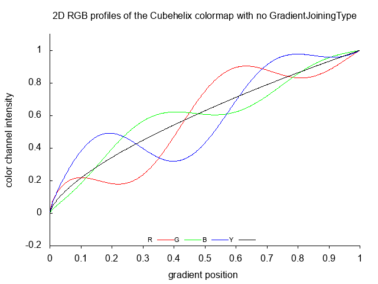  


the colour scheme spirals (as a squashed helix) around the diagonal of the RGB colour cube   

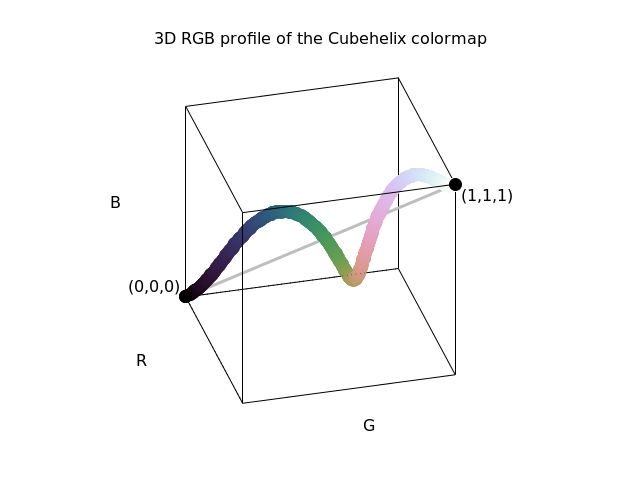  


Steps:  
")  
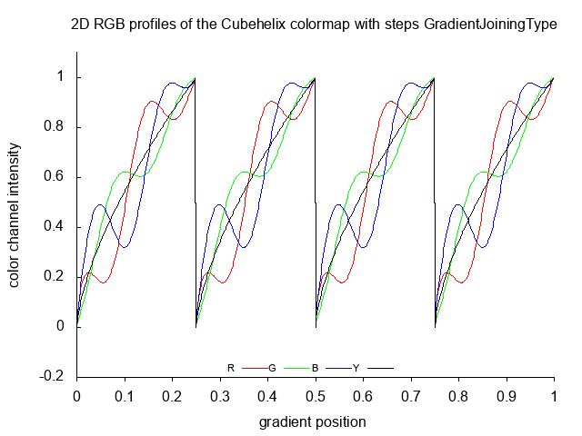  

Tubes:  

")  
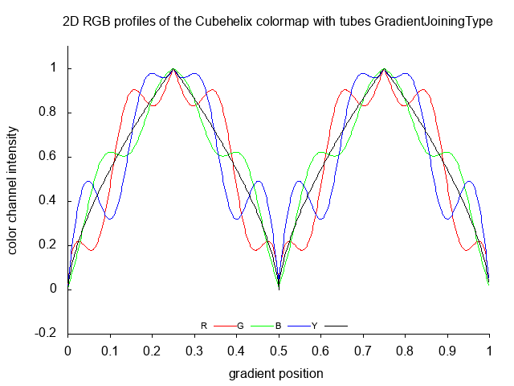  


See also: 
* [try out different `cubehelix' colour schemes below, and optionally produce a `look-up-table' file in several formats. ](http://www.mrao.cam.ac.uk/~dag/CUBEHELIX/cubetry.html)
* [David Johnstone: cubehelix-gradient-picker](http://davidjohnstone.net/pages/cubehelix-gradient-picker)


## arctic

[The GRID-Arendal Maps & Graphics Library](https://www.grida.no/resources?media=Graphic) is an on-going project to collect and catalogue all graphic products that have been prepared for publications and web-sites from the last 15 years in a wide range of themes related to environment and sustainable development

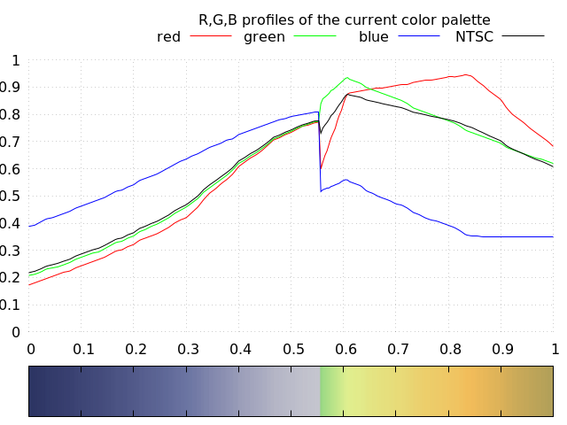

One can see here:
* it is diverging gradient. It is also non symetrical ( peak is nota at 0.5 )
* gradient info from cpt-city: −5000 … 4000, mixed, RGB, 110 segments
* [jump discontinuity](https://en.wikipedia.org/wiki/Classification_of_discontinuities#Jump_discontinuity) of blue and red curves
* curves are not smooth, probably because of numerical conversion from other format

See:
* [original gpf file](http://soliton.vm.bytemark.co.uk/pub/cpt-city/arendal/tn/arctic.png.index.html) from [cpt-city](http://soliton.vm.bytemark.co.uk/pub/cpt-city) - An archive of colour gradients by J.J. Green
* [arctic.gpf](./src/arctic.gpf) - local copy


## default Fractint map
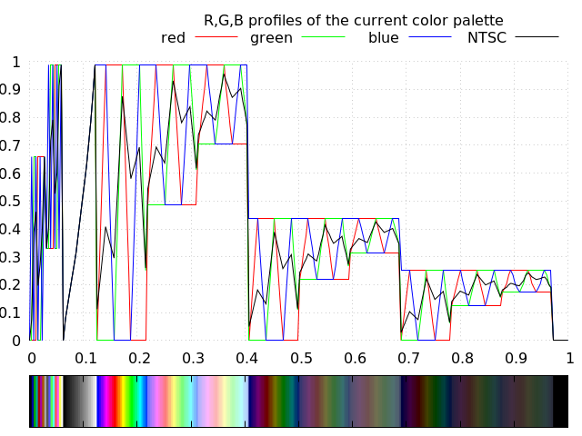

It seem that is a multi purpose gradient

It was made from default.map with gnuplot code:  


```gnuplot
set palette file "default.map" using ($1/255):($2/255):($3/255) 
set terminal png
set output "fractint.png"
test palette
```


See:  
* [fractint](https://en.wikibooks.org/wiki/Fractals/fractint)
* [fractint.map](./src/fractint.map)
* [commons](https://commons.wikimedia.org/wiki/File:Fractint_default_colour_map.png)


# guide to working with the source code

## conventions
* image file names = ColorTransferFunction_GradientJoining[_2D].png wher optional part 2D means 2D profiles of color
* ColorTransferFunction takes input in [0,1] and gives output in [0,1] range 


## API Reference

simple one file c programs which 
- do not need any extra libraries 
- can be run from console
- compiled with gcc 
- multiplatform

How to compile and run is described in the comments of c files


## files

All my images here are made with 
* c console program with gradients made of functions
* Image Magic convert console program
* gnuplot scripts

to make all images go to src directory and:
```
make
```


### programs
[Makefile](./src/Makefile)

c console programs:
* [d.c](./src/d.c) - c program with similar to p.c but with output in range [0,1]
* [s.c](./src/s.c) - c progrm for create enum from array of strings (lazy and naive method but works for me)
* [p.c](./src/p.c) - c program with output in range [0,255].  It creates 2 files (*.ppm and *.txt) for each colormap ( explicit transfer function)  
* [h.c](./src/h.c) - c code for creating *.txt files with data. It converts hsv to rgb 
* [j.c](./src/j.c) - c program which creates gradient files in json format for [colormeasure ](https://colormeasures.org/viewer/).  It uses explicit transfer functions. Output is in [0,1] range 

gnuplot programs
* [plot.gp](./src/plot.gp) - gnuplot program which creates *.png fils from *.txt files
* [plot2.gp](./src/plot2.gp) - gnuplot code for 3d rgb profile
* [cubehelix.gp](./src/cubehelix.gp) - gnuplot code for 2d and 3d rgb profile of cubehelix color map
* [plot3d.gp](./src/plot3d.gp)


python programs
* [simplest_regression.py](./src/simplest_regression.py) - python program by [P. Lutus](http://arachnoid.com) released under the GPL


make files
* [Makefile](./src/Makefile) : compiles d.c, run it and plot.gp 


### palettes
pal files ( files with gnuplot code, use load command )
* [diverging_map_gnuplot.pal](./src/diverging_map_gnuplot.pal) = blue-red diverging gradient 

json files in [src dir](./src/) for [colormeasure ](https://colormeasures.org/viewer/)
 
# similar projects
* [hsluv-color-gradient](https://github.com/adammaj1/hsluv-color-gradient)
* [Wave form or shaping functions](https://github.com/adammaj1/Waveform)
* [Shaping functions in GLSL by Patricio Gonzalez Vivo & Jen Lowe](https://thebookofshaders.com/05/)
* [curves by kynd.inf ](https://www.flickr.com/photos/kynd/9546075099/in/photostream/)
* [GraphToy by Iñigo Quilez = a tool to visualize GLSL functions in WebGL](https://graphtoy.com/)
* [cmlib](https://github.com/titusjan/cmlib) - color map library is a collection of color maps that have been converted to a uniform format ( csv+json)
* [COLOR RAMP FORMULATOR in js by ](https://github.com/tonton-pixel/color-ramp-formulator) Michel Mariani (tonton-pixel )
* [ColorRampGenerator](https://github.com/Exerionius/ColorRampGenerator) - to make a color ramp out of the base color ( Sequential Discrete color gradient)
* [colorcet](https://github.com/holoviz/colorcet) - perceptually uniform colormaps for use with Python based on the set of perceptually uniform colormaps created by Peter Kovesi 
* [viscm](https://github.com/matplotlib/viscm) - tool for analyzing colormaps and creating new colormaps
* [CMasher](https://github.com/1313e/CMasher) - a collection of scientific colormaps and utility functions ( Python)
* [bipolar-colormap](https://github.com/endolith/bipolar-colormap) - diverging
* [gimp-color-palettes](https://github.com/Robert-96/gimp-color-palettes)
* [colormap-shaders](https://github.com/kbinani/colormap-shaders)
* [pycolormap](https://github.com/yuki-koyama/pycolormap)
* [tinycolormap](https://github.com/yuki-koyama/tinycolormap)
* [cppcolormap](https://github.com/tdegeus/cppcolormap)
* [ColorMap](https://github.com/alesgenova/colormap) - A flexible library to map numerical values to colors ( opacity and color)
* [colorgrad](https://github.com/mazznoer/colorgrad)
* [SciColorMaps](https://github.com/ar1st0crat/SciColorMaps)


# technical notes
I'm not an expert in the color, so many errors can be here. If you will find them let me know: issues or [wikibooks](https://en.wikibooks.org/wiki/User_talk:Adam_majewski)


## Contributors

Program uses code from:
* GNUPLOT - stdfn.h  Copyright 1986 - 1993, 1998, 2004   Thomas Williams, Colin Kelley 
* [Linas Vepstas](http://linas.org/art-gallery/index.html)
* [gnuplotting.org](https://github.com/Gnuplotting/gnuplot-palettes/blob/master/magma.pal)
* [public domain function by Darel Rex Finley, 2006](alienryderflex.com/hsp.html)
* python program by [P. Lutus](http://arachnoid.com) released under the GPL

Program uses idea from : 
* [fractalizer](http://www.fractalizer.de/en/)
* [histogram equalisation](https://en.wikipedia.org/wiki/Histogram_equalization) and  [FF: histogram-colouring-is-really-streching-(not-true-histogram)/](http://www.fractalforums.com/kalles-fraktaler/histogram-colouring-is-really-streching-(not-true-histogram)/)


### How to contribute ?
Contributors are wellcome.   


How to do it ( after [darktable](https://github.com/darktable-org/darktable#contributing) ) : 
* Write a blog about it
* Create a tutorial for it
* Help expand the user wiki
* Answer questions on the user mailing list
* Share your ideas on the developer mailing list
* Test releases
* Review pull requests
* Start hacking on the program and see developer's guide
 
See also:
* [darktable developer's-guide](https://github.com/darktable-org/darktable/wiki/Developer's-guide)
* [darktable  coding-style](https://github.com/darktable-org/darktable/wiki/Developer's-guide#coding-style)

  
# License

[licence](LICENCE)

# Star History

[](https://star-history.com/#adammaj1/1D-RGB-color-gradient&Date)


# Git


```git
cd existing_folder
git add .
git commit -m "Initial commit"
git push -u origin main
```


```
  git clone git@github.com:adammaj1/1D-RGB-color-gradient.git
```

Subdirectory

```git
mkdir images
git add *.png
git mv  *.png ./images
git commit -m "move"
git push -u origin main
```
then link the images:

```txt
 

```
to overwrite 
```git
git mv -f 
```


local repo : ~/1D-RGB-color-gradient
